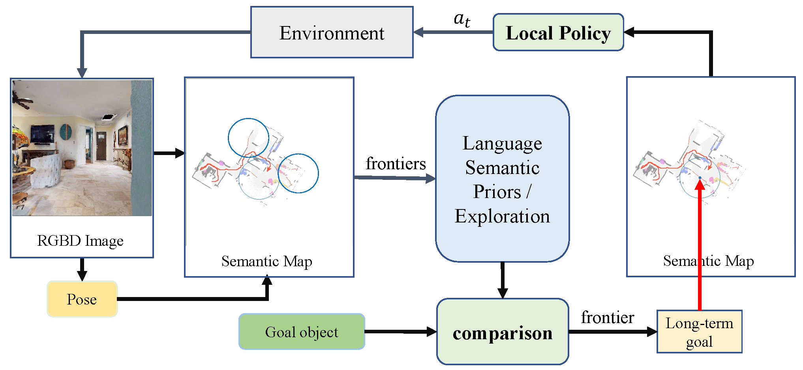

# L3MVN: Leveraging Large Language Models for Visual Target Navigation

This work is based on our paper. We proposed a new framework to explore and search for the target in unknown environment based on Large Language Model. Our work is based on [SemExp](https://github.com/devendrachaplot/Object-Goal-Navigation) and [llm_scene_understanding](https://github.com/neurips2020submission/invalid-action-masking), implemented in PyTorch.

**Author:** Bangguo Yu, Hamidreza Kasaei and Ming Cao

**Affiliation:** University of Groningen

## Frontier Semantic Exploration Framework

Visual target navigation in unknown environments is a crucial problem in robotics. Despite extensive investigation of classical and learning-based approaches in the past, robots lack common-sense knowledge about household objects and layouts. Prior state-of-the-art approaches to this task rely on learning the priors during the training and typically require significant expensive resources and time for  learning. To address this, we propose a new framework for visual target navigation that leverages Large Language Models (LLM) to impart common sense for object searching. Specifically, we introduce two paradigms: (i) zero-shot and (ii) feed-forward approaches that use language to find the relevant frontier from the semantic map as a long-term goal and explore the environment efficiently. Our analysis demonstrates the notable zero-shot generalization and transfer capabilities from the use of language. Experiments on Gibson and Habitat-Matterport 3D (HM3D) demonstrate that the proposed framework significantly outperforms existing map-based methods in terms of success rate and generalization. Ablation analysis also indicates that the common-sense knowledge from the language model leads to more efficient semantic exploration. Finally, we provide a real robot experiment to verify the applicability of our framework in real-world scenarios. The supplementary video and code can be accessed via the following link: https://sites.google.com/view/l3mvn.



<!-- ## Requirements

- Ubuntu 20.04
- Python 3.7
- [habitat-lab](https://github.com/facebookresearch/habitat-lab) -->

## Installation

The code has been tested only with Python 3.7 on Ubuntu 20.04.

1. Installing Dependencies
- We use challenge-2022 versions of [habitat-sim](https://github.com/facebookresearch/habitat-sim) and [habitat-lab](https://github.com/facebookresearch/habitat-lab) as specified below:

- Installing habitat-sim:
```
git clone https://github.com/facebookresearch/habitat-sim.git
cd habitat-sim; git checkout tags/challenge-2022; 
pip install -r requirements.txt; 
python setup.py install --headless
python setup.py install # (for Mac OS)
```

- Installing habitat-lab:
```
git clone https://github.com/facebookresearch/habitat-lab.git
cd habitat-lab; git checkout tags/challenge-2022; 
pip install -e .
```

- Install [pytorch](https://pytorch.org/) according to your system configuration. The code is tested on pytorch v1.7.0 and cudatoolkit v11.4. If you are using conda:
```
conda install pytorch==1.7.0 torchvision==0.8.1 cudatoolkit=11.4 #(Linux with GPU)
conda install pytorch==1.7.0 torchvision==0.8.1 -c pytorch #(Mac OS)
```

- Install [detectron2](https://github.com/facebookresearch/detectron2/) according to your system configuration. 

2. Download HM3D datasets:

#### Habitat Matterport
Download [HM3D](https://aihabitat.org/datasets/hm3d/) dataset using download utility and [instructions](https://github.com/facebookresearch/habitat-sim/blob/089f6a41474f5470ca10222197c23693eef3a001/datasets/HM3D.md):
```
python -m habitat_sim.utils.datasets_download --username <api-token-id> --password <api-token-secret> --uids hm3d_minival
```

3. Download additional datasets

Download the [segmentation model](https://drive.google.com/file/d/1U0dS44DIPZ22nTjw0RfO431zV-lMPcvv/view?usp=share_link) in RedNet/model path.


## Setup
Clone the repository and install other requirements:
```
git clone https://github.com/ybgdgh/L3MVN
cd L3MVN/
pip install -r requirements.txt
```

### Setting up datasets
The code requires the datasets in a `data` folder in the following format (same as habitat-lab):
```
L3MVN/
  data/
    scene_datasets/
    matterport_category_mappings.tsv
    object_norm_inv_perplexity.npy
    versioned_data
    objectgoal_hm3d/
        train/
        val/
        val_mini/
```


### For evaluation: 
For evaluating the pre-trained model:
```
python main_llm_vis.py --split val --eval 1 --auto_gpu_config 0 \
-n 1 --num_eval_episodes 2000 --load pretrained_models/llm_model.pt \
--use_gtsem 0 --num_local_steps 10
```


## Demo Video

[video](https://sites.google.com/view/l3mvn)